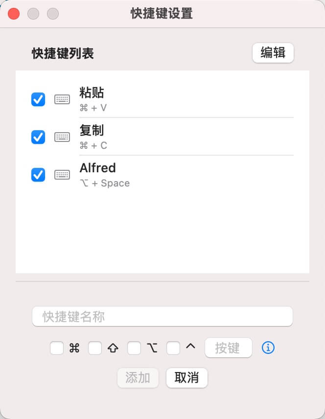
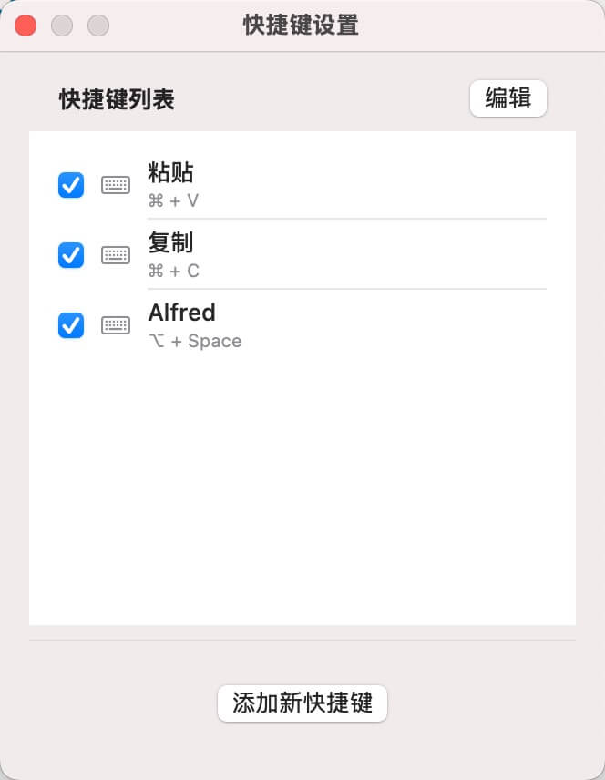

🔧 RemoteKeyPad – 让你的 Mac 快捷键重现
还在为远程控制 Mac 时无法使用你最爱的快捷键而苦恼吗？
RemoteKeyPad 是优雅的解决方案，让快捷键一键重现。

🚀 什么是 RemoteKeyPad？
RemoteKeyPad 是一款轻量级 macOS 应用，将简洁界面变为强大的快捷键启动器。无论你使用屏幕共享、VNC 还是远程桌面，这款应用都能让你触发系统范围的快捷键——即使远程会话无法传递的快捷键也能实现。

只需轻点一下，即可模拟如 ⌘+C、⌘+V、⌘+Q 等复杂组合——无需实体键盘。

✨ 功能特色
🖱️ 一键快捷：点击按钮，立即执行快捷键。

实际使用界面简洁明了，让你一键触发所需快捷键，提升远程操作效率。

⌨️ 支持修饰键：包含 Command、Option、Control 和 Shift。

🔐 安全私密：仅需 macOS 辅助功能权限。数据绝不离开本机。

🧰 可自定义操作（即将推出）：创建你自己的组合并随心组织。

添加新快捷键只需几步，轻松扩展你的快捷键库

🖥️ 远程会话无缝支持：再也不用担心 VNC 或屏幕共享下快捷键失效。

📦 适用人群：
- 远程在 Mac 上开发的程序员
- 管理无头 macOS 服务器的系统管理员
- 对远程工具快捷键受限感到沮丧的任何人

🛠 技术栈
- Swift
- AppKit
- macOS 辅助功能 API

🧪 试用方法
克隆仓库，在 Xcode 中打开项目并运行。首次启动会提示你开启辅助功能权限——请放心，所有操作仅在本地完成，安全可靠。

自定义编辑界面让你能够灵活调整和管理每一个快捷键组合，操作简单高效。

通过简洁直观的设置界面，你可以快速配置常用的快捷键，满足不同场景的需求。

🤝 参与贡献
项目刚刚起步，欢迎提交 issue、建议新功能或直接 PR！

