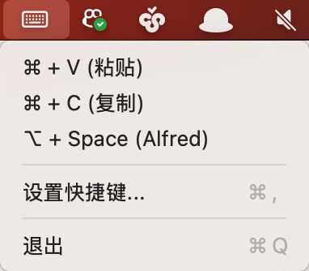
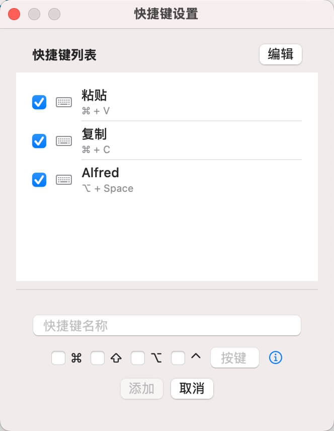
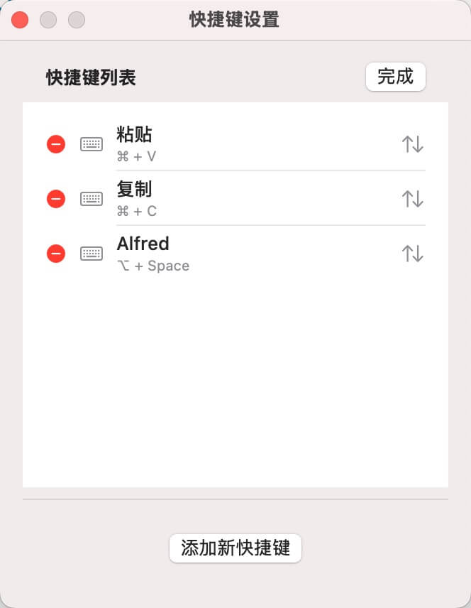
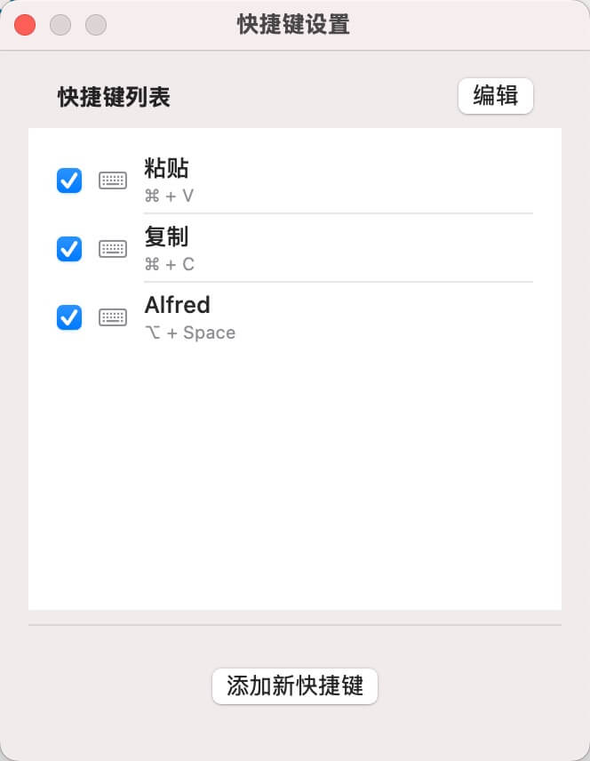

🔧 RemoteKeyPad – Bring Back Your Mac Shortcuts
Tired of losing access to your favorite keyboard shortcuts when remotely controlling your Mac?
RemoteKeyPad is the elegant solution that brings them back — one click at a time.

🚀 What is RemoteKeyPad?
RemoteKeyPad is a lightweight macOS app that transforms a simple interface into a powerful shortcut launcher. Whether you're using Screen Sharing, VNC, or a remote desktop session, this app lets you trigger system-wide keyboard shortcuts — even the ones your remote session can't deliver.

With a single tap, simulate complex combinations like ⌘+C, ⌘+V, ⌘+Q, and more — no physical keyboard needed.

✨ Features
🖱️ One-Click Shortcuts: Tap a button, execute a shortcut — instantly.

The actual usage interface is simple and clear, allowing you to trigger any shortcut with a single tap and boost your remote productivity.

⌨️ Support for Modifier Keys: Includes Command, Option, Control, and Shift.

🔐 Secure and Private: Requires only macOS accessibility permission. No data leaves your machine.

🧰 Customizable Actions (coming soon): Create your own combinations and organize them your way.

Adding a new shortcut is just a few steps away, making it easy to expand your shortcut library.

🖥️ Works Seamlessly with Remote Sessions: No more lost keyboard mappings over VNC or Screen Sharing.

📦 Perfect for:
Developers working remotely on their Mac.

Sysadmins managing headless macOS servers.

Anyone frustrated by shortcut limitations in remote access tools.

🛠 Built With
Swift

AppKit

macOS Accessibility APIs

🧪 Try It Out
Clone the repo, open the project in Xcode, and run it. On first launch, it'll prompt you to enable Accessibility — don't worry, it's local and secure.

The editor interface allows you to flexibly adjust and manage each shortcut combination with ease.

Easily configure your favorite shortcuts through a clean and intuitive settings interface, tailored for different scenarios.

🤝 Contribute
We're just getting started. Feel free to open issues, suggest new features, or submit a pull request! 